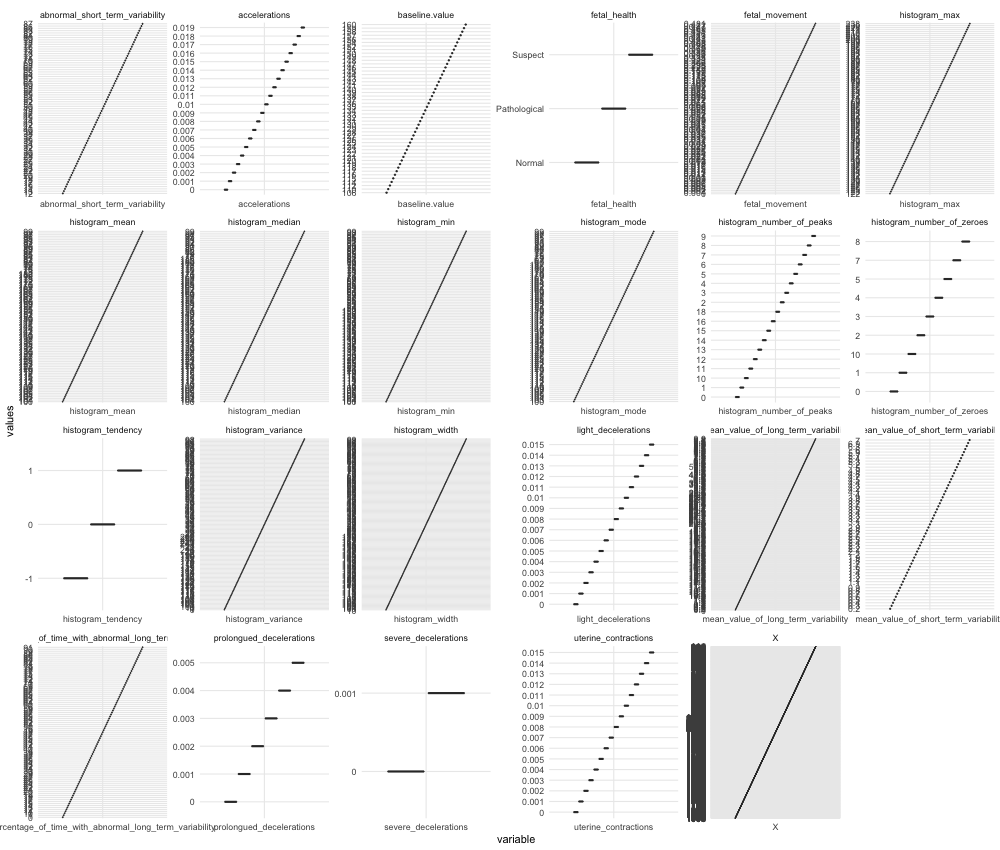

```{r, include=FALSE}
library(knitr)
library(dplyr)
library(kableExtra)
select <- dplyr::select
knitr::opts_chunk$set(echo = FALSE)

defOut <- knitr::knit_hooks$get("plot")  # save the default plot hook 
knitr::knit_hooks$set(plot = function(x, options) { 
  x <- defOut(x, options)  # apply the default hook
  if(!is.null(options$wrapfigure)) {
    # create the new opening string for the wrapfigure environment ...
    wf <- sprintf("\\begin{wrapfigure}{%s}{%g\\textwidth}", options$wrapfigure[[1]], options$wrapfigure[[2]])
    x  <- gsub("\\begin{figure}", wf, x, fixed = T)  # and replace the default one with it.
    x  <- gsub("{figure}", "{wrapfigure}", x, fixed = T)  # also replace the environment ending
  }
  return(x)
})

```


```{r, fig.width=8.5, fig.height = 6, out.width = ".85\\textwidth", fig.cap = "Scatter Plot by State", fig.pos = "H", fig.align='center'}

```


```{r, fig.width=8.5, fig.height = 6, out.width = ".85\\textwidth", fig.cap = "Scatter Plot by State", fig.pos = "H", fig.align='center'}
include_graphics("./figures/figure2.png")
```


