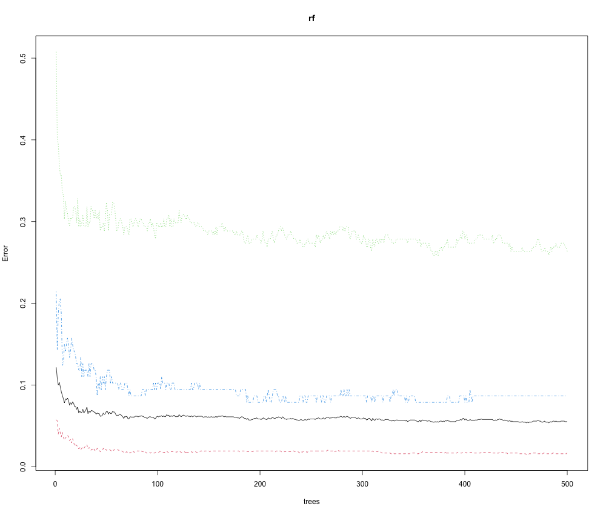

```{r, include=FALSE}
library(knitr)
library(dplyr)
library(kableExtra)
select <- dplyr::select
knitr::opts_chunk$set(echo = FALSE)

defOut <- knitr::knit_hooks$get("plot")  # save the default plot hook 
knitr::knit_hooks$set(plot = function(x, options) { 
  x <- defOut(x, options)  # apply the default hook
  if(!is.null(options$wrapfigure)) {
    # create the new opening string for the wrapfigure environment ...
    wf <- sprintf("\\begin{wrapfigure}{%s}{%g\\textwidth}", options$wrapfigure[[1]], options$wrapfigure[[2]])
    x  <- gsub("\\begin{figure}", wf, x, fixed = T)  # and replace the default one with it.
    x  <- gsub("{figure}", "{wrapfigure}", x, fixed = T)  # also replace the environment ending
  }
  return(x)
})

```


# 1. Introduction 

Monitoring fetal growth during pregnancy is one of the most challenging and complex processes in the field of medicine. According to the World Health Organization (WHO), approximately 810 pregnant women die every day, even with preventable measures. Maternal mortality rate (MMR) is fairly low in developed countries and high in less developed countries. Common complications behind high MMR include preeclampsia, unborn baby status and improper monitoring of the mother, and gestational diabetes. MMR can be reduced and prevented with proper medical care. A standard procedure done in the third trimester is fetal monitoring. Fetal monitoring is the checking of the health of the unborn baby. The growth of the fetus depends entirely on the health of the mother. To avoid such complications, fetal heart rate monitoring is used to continuously measure the health and growth rate of the fetus. Fetal monitoring is designed to track the fetus' heartbeat and measure the mother's uterine contractions at the same time. This process will take place in the last trimester, once the fetus' growth is fully in line with the heart rate.

As medical technology improves, preventable child mortality falls. Reducing child mortality has become a key goal in driving the progress of any society, and the key to the progress of humanity as a whole. While there have been many advances that have reduced mortality, not all of these practices are available globally. To reduce mortality, cost-effective and readily available solutions need to be applied and refined. One such cost-effective and relatively simple method is the use of an electrocardiogram (CTG). A CTG is a non-invasive fetal monitor used to assess fetal health. CTG is used to detect fetal heart rate (FHR), uterine contractions, fetal movements, and sudden changes in heart rate. Extreme changes in FHR lead to surgical intervention through the use of Caesarean section (C-section). Currently, physicians rely on visual analysis of CTGs, leading to misinterpretation of the exam. Small changes that are extremely detrimental to the health of the fetus may not be visible to the naked eye. Conversely, some observable changes in fetal heart rate may appear to be fetal distress but are simply a response to other factors such as uterine contractions. Choosing caesarean section will not only increase the mortality rate of the child, but also increase the mortality rate of the mother. For these reasons, visual analysis of CTG examinations is limited by human error and cannot definitively detect fetal distress.

For our analysis, we used the CTG exam dataset on Kaggle from the Journal of Maternal-Fetal Medicine. This dataset contains 2126 CTG examination records, which are classified into three categories (normal, suspicious, pathological). In this initial analysis, we decided to create a binary class Normal and Suffering, merging the Suspicious and Pathological classes into one class.

To address the problem of eliminating human error and erroneous surgical interventions, the goal of our analysis was to identify which key features played a role in determining the healthy or unfavorable class and generate high-precision models to eliminate unnecessary cesarean deliveries. To achieve these goals, we performed logistic regression model with a backwards step-wise feature selection to determine the importance of each covariates in prediction of fetal health. We aim to identify which features have the most impact on fetal health. Using these features, we also aim to tune a model that provides the best predictions of fetal health class. 


# 2. Analysis 

# 2.1 Demorgraphic analysis 
|Variable| Explanation  | 
|:--- | ---: | 
|baseline_value | Baseline Fetal Heart Rate|
|accelerations  | Number of accelerations per second|
|fetal_movement |Number of fetal movements per second|
|uterine_contractions |Number of uterine contractions per second|
|light_decelerations | Number of LDs per second|
|severe_deceleration | Number of Sds per second|
|prolongued_deceleration |Number of PDs per second |
|abnormal_short_term_variatability | Percentage of time with abnormal short tearm variatability|
|mean_value_of_short_term_variability | Mean value of short term variability|
|percentage_of_time_with_abnormal_long_term_variability | Percentage of time with abnormal long term variability|
|mean_value_of_long_term_variability | average value of long tearm variability|
|histogram_width |Width of histogram using all the values from the record|
|histogram_min | minimum value of histogram|
|histogram_max | maximum value of hitogram|
|histogram_number_of_peaks | number of peaks in the exam histogram|
|histogram_number_of_zeroes | number of zeros in the exam histogram|
|histogram_mode | histogram mode|
|histogram_mean | histogram mean |
|histogram_median | histogram median|
|histogram_variance | histogram variance|
|histogram_tendency | histogram tendancy|
|fetal_health | 1: normal 2:Suspect 3: Pathological|


Accorrding to the graph below we can see the distribution of each variables, then we perform the analysis with all the variables below. Moreover, we can see the historgram of the fetal health distribution from the figure below, the majority of the fetal health status are normal and there is no abvious outilers for all the coavriates. 

```{r, fig.width=8.5, fig.height = 6, out.width = ".85\\textwidth", fig.cap = "Scatter Plot of each covarites ", fig.pos = "H", fig.align='center'}
include_graphics("./figures/figure2.png")
```

```{r, fig.width=6.5, fig.height = 4, out.width = ".85\\textwidth", fig.cap = "Histrogram of three fetal health group", fig.pos = "H", fig.align='center'}

```


# 2.1 Regression Analysis
The main cause of fetal death is a slowed heart rate. three Types of decelerations are common: mild, severe, and prolonged. Light slows down due to
Uterine contractions compress the fetal head. But the advanced reducer is
Warning signs of a low fetal heart rate. RA on deceleration and type of uterus
Shrinkage would be a useful graph as it would predict the health of the current situation at the time
deliver. Statistical analysis will give the relationship between features. We first dichotomize the fetal health into two categoria, which is 0: normal and 1: suspect or Pathological, and then employ backwards stepwise to selection the most important variable in the model. 

After stepwise model selection, we have the final logistic model as follows, and according to the model estimate and t- test result. The most influential cocariates when fiiting the model is abnormal_short_term_variability, percentage_of_time_with_abnormal_long_term_variability and prolongued_decelerations. And all of the three have a posotive effect of the log odds ratios comparing from 1: suspect or Pathological to 0: normal, holding all the others constant. While the histogram_median and accelerations have a negative effect on the log odds ratios  from 1: suspect or Pathological to 0: normal, holding all the others constant. Also, we use the test set to evaluate the prediction accuracy of this logistic model, and the accuracy equals to 0.908. 


|Coefficients:   |   Estimate |Std. Error|t value|P value|   
|:---     |---:|:---|:---| :---| 
|Intercept |-8.523e-01|1.167e-01  |-7.302 |4.68e-13 ***|
|baseline.value |5.356e-03 | 1.754e-03  | 3.053 | 0.00231 ** |
|accelerations  | -1.714e+01 | 2.787e+00|  -6.149 |1.01e-09 ***|
|uterine_contractions |-1.982e+01  |2.804e+00 | -7.068 |2.44e-12 ***|
|severe_decelerations |   4.155e+02 | 1.267e+02 |  3.280 | 0.00106 ** |
|prolongued_decelerations |1.870e+02 | 1.759e+01  |10.629 | < 2e-16 ***|
|abnormal_short_term_variability |5.465e-03|  5.280e-04 | 10.350 | < 2e-16 ***|
|percentage_of_time_with_abnormal_long_term_variability | 7.363e-03  |5.372e-04 | 13.704 | < 2e-16 ***|
|histogram_width | 3.358e-03  |7.780e-04  | 4.316 |1.69e-05 ***|
|histogram_min |5.277e-03 | 1.146e-03 |  4.606 |4.48e-06 ***|
|histogram_median | -4.565e-03 | 1.592e-03|  -2.868 | 0.00419 ** |
|histogram_variance  | 1.674e-03 | 3.693e-04  | 4.532 |6.33e-06 ***|
|histogram_tendency |  3.679e-02  |2.092e-02 |  1.759 | 0.07882 .|

# 2.2 Correlation Analysis
The analysis will help doctors and midwives focus on vital parameters
Fetal health. The table below summarizes the relative values of the various factors that contribute to the influence
Fetal health. Correlation is used to find the relationship between two features in a dataset. it
Explain how one feature relates to another. The idea behind associating is to solve the curse
dimension. Since the dataset contains a large amount of medical data, the dataset requires
Dimensionality reduction. Therefore, this can be calculated by
feature. This matrix will compute correlation coefficients for various features for illustration
Valuable patterns in a given dataset. CA is used to find out the relationship between features
Participation model. This will help to strengthen the exploratory analysis performed previously
A corresponding model for the monitoring system is suggested. The realization of the covariance and
The correlation matrix is to reduce the dimensionality in the dataset. When dimensionality reduction has
After execution, the accuracy and reliability of the model is improved. this is a makeover
High-dimensional data to low-dimensional data.

From the Figure below we can see that when the condition of heartbeat experiences a decline for
a prolonged time, then the doctor has to make a quick decision in restoring fetal health. A similar
disease is observed for S-TV and time for which abnormal variability in heart rate is sensed.

```{r, fig.width=8.5, fig.height = 6, out.width = ".85\\textwidth", fig.cap = "Correlation test between all features", fig.pos = "H", fig.align='center'}

```
# 2.3 Random Forest
Then we details CTG based health classification of fetus based on a multi-class morphologic pattern from 21 features. The classification is done based on the most influential features from the dataset. Random forest method are developed to predict the consistencies in fetal health.
We first partioning Dataset into 70% training set and 30% test set, then the performing the model with the training set and get the table as follows: 


|Confusion matrix: |Normal |Suspect |Pathological |class.error
|:--- |---:|:---| ---:| ---:| 
|Normal  |1175  |18 |  2 | 0.01673640|
|Suspect  | 49  |   148 | 4  |0.26368159|
|Pathological |6  |5 |116  |0.08661417|

The predicted model with the test dataset is as follows, according to the table we have the predicted sensitivity for normal group is 1, 0.9787 for suspect group, and 0.9796 for pathological. Meanwhile, the specificity is 0.9930 for normal group, 1 for suspect group and 0.96 for the pathological group. Meanwhile we have the 

|Statistics by Class:| Class: Normal |Class: Suspect| Class: Pathological|
|:--- | ---: | :--- | ---: | 
|Sensitivity|1.0000 |0.9787 | 0.97959|
|Specificity|  0.9930 | 1.0000|0.99639|
|Pos Pred Value| 0.9978|1.0000 |0.96000|
|Neg Pred Value |1.0000 | 0.9961 | 0.99819|
|Prevalence|0.7629 |0.1559 |0.08126|
|Detection Rate| 0.7629 |0.1526| 0.07960|
|Detection Prevalence|0.7645 |0.1526| 0.08292|
|Balanced Accuracy|0.9965|0.9894 | 0.98799|

From the variable importance plot, we note that in the random forest process the most influence variable are percentage_of_time_with_abnormal_long_term_variability and abnormal_short_term_variability, which means that those feature should be pay more attention during the CTG exam. 

|Varibles |Normal |  Suspect |Pathological |Mean Decrease Accuracy| Mean Decrease Gini|
|:--- | ---: | :--- | ---: |  ---: | :--- | 
|baseline.value|16.755159  |7.204686  |   6.195587  | 20.074491 |     18.96656835|
|accelerations | 21.389807 |16.684894  |  10.426987  |  24.040380    |  21.31578221|
|fetal_movement | 10.363624 |10.841383  |   2.198147  |   14.246901   |    9.54583146|
|uterine_contractions  |    12.161666 |17.232277 |   17.461865      |      25.155089   |   19.38176012|
|light_decelerations   |  3.219311 | 2.583210  |   5.676074  |   6.916367    |   2.92124653|
|severe_decelerations  | 1.343642 | 0.000000  |   0.000000  |      1.345363|0.06409742|
|prolongued_decelerations |  28.394773 | 7.328171  |  16.404821 | 28.695284    |  31.92331266|
|abnormal_short_term_variability   | 18.500301| 31.908361 |   30.538363    |        34.133417 |     86.53462123|
|mean_value_of_short_term_variability | 15.603849| 24.569828   | 22.423406 |    27.247028  |    79.68191790|
|percentage_of_time_with_abnormal_long_term_variability |24.927668 |30.510493 |   37.828124  |          41.444380   |   78.82674486|
|mean_value_of_long_term_variability | 13.549653 |10.425724 |    8.466998|    17.695609 | 22.59146362|
|histogram_width  | 11.014866 | 4.036388 |    5.142748    |        12.828994   |   13.74206205|
|histogram_min| 10.467956  |5.835111 |    7.507953  |    13.534341  |    13.45523806|


```{r, fig.width=8.5, fig.height = 6, out.width = ".85\\textwidth", fig.cap = "Model performance ", fig.pos = "H", fig.align='center'}

```


Those figure below shows how the  pure the nods are at the end of the tree without each variable. 
```{r, fig.width=8.5, fig.height = 6, out.width = ".85\\textwidth", fig.cap = "Partial Dependency Plot", fig.pos = "H", fig.align='center'}

```


# 4. Conclusion
Health complications during pregnancy pose major challenges
within the globe. Maternal malnutrition, eating habits, drug consumption and congenital
Diseases are common health problems that affect fetal development. this job evaluation
Prediction of fetal health status through the influence of various factors measured by CTG. 
In the analysis above, we comparing the logistic regression model and random forest model as well as the correlation study in order to find the most influential features in identifying the status of fetal health measured by CTG. From the result, we can conclude that the Random forest performs better in model fitting and prediction. In summary, we can see that the most influential variables are abnormal short term variability, prolongued decelerations, percentage of time with abnormal long term variability. This research work will be helpful for the doctors in making
timely decisions to save the life of both mother and child.


